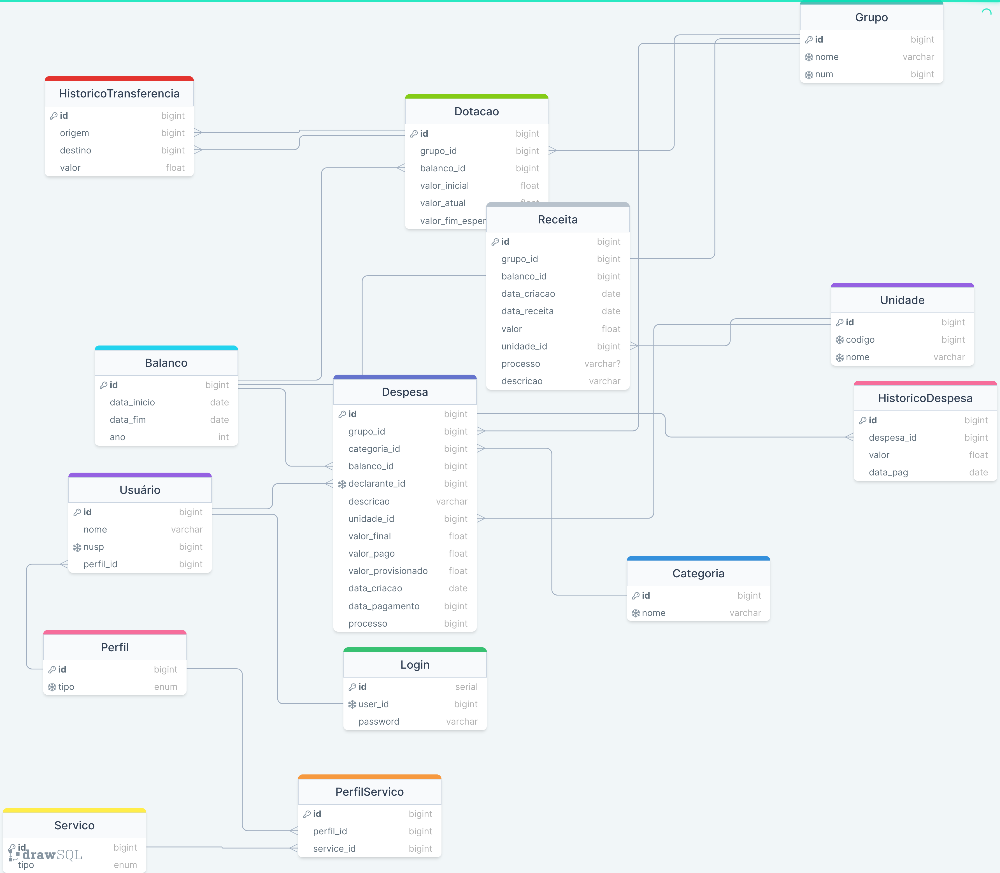

# planejamento-orcamentario-api

## About

planejamento-orcamentario-api is a `Spring` API that communicates with a `PostgreSQL` database for the planejamento-orcamentario-web application, developed as a project for the course `MAC0427 - Laboratório de Métodos Ágeis (2023)`.

## Running information

### Installation & Execution

```bash
git clone https://github.com/mac0427/planejamento-orcamentario-api.git
cd planejamento-orcamentario-api
cp src/main/resources/application.properties-default src/main/resources/application.properties
# edit src/main/resources/application.properties
gedit src/main/resources/application.properties
# insert database information
# open the project in your favorite IDE and run it from there
# IntelliJ example
idea.sh
```

### Run tests

```bash
cd planejamento-orcamentario-api
cp src/test/resources/application-test.properties-default src/main/resources/application-test.properties
# edit src/main/resources/application-test.properties with your favorite editor
# gedit example
gedit src/main/resources/application-test.properties
# insert database information
# open the project in your favorite IDE and run it from there
# IntelliJ example
idea.sh
```

### DrawSQL model

The tables defined in `src/main/resources/db/migration` are inspired by a `DrawSQL` model, but not fully implemented.

The model can be seen below:


### Docker Compose

planejamento-orcamentario-api communicates with a `POSTGRESQL` database, that can be initiated via `Docker Compose` file.

A Docker container can be started as follows:

```bash
cd planejamento-orcamentario-api
cp .default.env .env
## edit .env to your liking
docker compose --env-file=.env up
# ... run application
# close docker container
docker compose down
```

### Postman API methods

The file LabXP.postman_collection.json can be imported to postman to see all API methods implemented.
